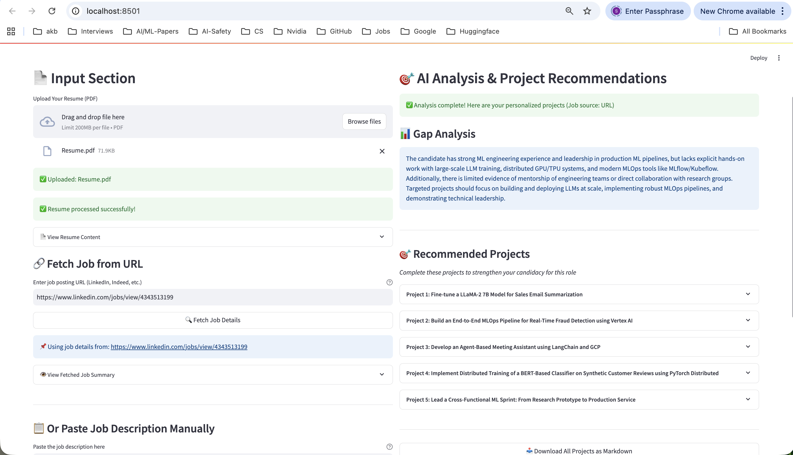
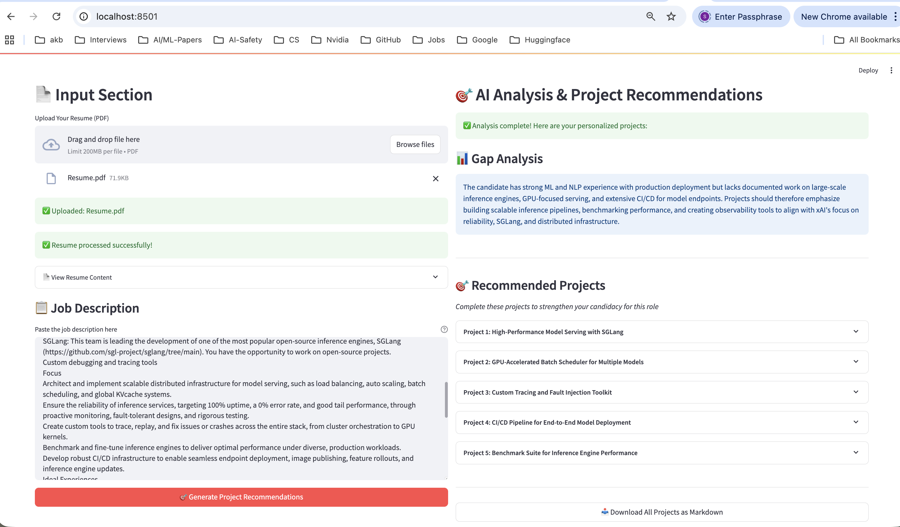
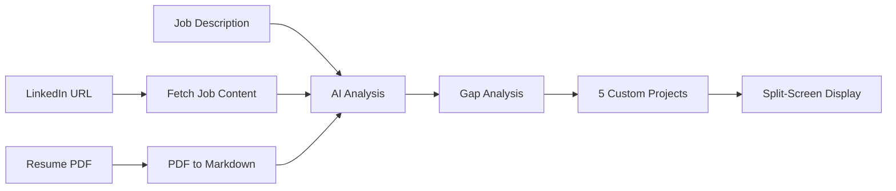

# 🎯 HandsOn.AI - Job Match Analyzer

An AI-powered Streamlit application that analyzes your resume against job descriptions and generates 5 personalized hands-on projects to help you prepare for your target role.

## 📸 Screenshots

### Main Interface




*Split-screen interface: Upload resume and job description on the left, get AI-generated project recommendations on the right*


*Fetch job details directly from LinkedIn URLs - no more copy-pasting job descriptions!*

## ✨ Features

- 📄 **PDF Resume Upload** - Upload your resume in PDF format
- 🔗 **URL Job Fetching** - Automatically fetch job details from LinkedIn URLs (NEW!)
- 📋 **Manual Job Description** - Or paste any job description manually
- 🤖 **AI-Powered Gap Analysis** - Identifies skill gaps between your profile and job requirements
- 🎯 **5 Custom Project Recommendations** - Get tailored hands-on projects with:
  - Clear project descriptions
  - Step-by-step implementation guides (3-5 steps per project)
  - Skills you'll learn mapped to job requirements
- 📥 **Export Projects** - Download all recommendations as a markdown file
- 🆓 **Completely Free** - Uses NVIDIA's free Nemotron model via OpenRouter

## 🚀 Quick Start

### Prerequisites

- Python 3.8 or higher
- OpenRouter API key (free - see setup below)

### Installation

1. Clone this repository:
```bash
git clone https://github.com/yourusername/handson.ai.git
cd handson.ai
```

2. Install dependencies:
```bash
pip install -r requirements.txt
```

3. Set up your OpenRouter API key (see [API Key Setup](#-openrouter-api-key-setup) below)

4. Run the app:
```bash
streamlit run app.py
```

5. Open your browser at `http://localhost:8501`

## 🔑 OpenRouter API Key Setup

This app uses [OpenRouter](https://openrouter.ai) to access AI models. The best part? **It's completely free!** We use NVIDIA's Nemotron-3-Nano model which has no cost.

### Step 1: Get Your Free API Key

1. Go to [OpenRouter.ai](https://openrouter.ai)
2. Click **"Sign In"** in the top right
3. Sign up using Google, GitHub, or email
4. Once logged in, go to [Keys](https://openrouter.ai/keys) or click your profile → "Keys"
5. Click **"Create Key"**
6. Give it a name (e.g., "HandsOn.AI") and click **"Create"**
7. Copy your API key (starts with `sk-or-v1-...`)

### Step 2: Configure the App

Create a `.env` file in the project root directory:

```bash
# Create .env file
touch .env
```

Add your API key to the `.env` file:

```env
OPENROUTER_API_KEY=sk-or-v1-your-api-key-here
```

**Important:** Never commit your `.env` file to Git! It's already in `.gitignore`.

### Cost Information

✅ **This app is FREE to use!**

- Model used: `nvidia/nemotron-3-nano-30b-a3b:free`
- Cost per request: **$0.00**
- No credit card required
- No usage limits

## 📖 How to Use

1. **Upload Your Resume**
   - Click "Upload Your Resume (PDF)" in the left column
   - Select your PDF resume file
   - Wait for it to process (usually 2-3 seconds)

2. **Add Job Description** (Choose one method):

   **Option A: Fetch from URL** ⭐ Recommended
   - Paste a LinkedIn job URL into the "Enter job posting URL" field
   - Click **"🔍 Fetch Job Details"**
   - Wait 30-60 seconds for the app to fetch and parse the job posting
   - The job details will be automatically loaded and displayed
   
   **Option B: Manual Paste**
   - Copy the full job description from any job posting
   - Paste it into the "Paste the job description here" text area
   - Include requirements, responsibilities, and qualifications for best results

3. **Generate Projects**
   - Click **"🎯 Generate Project Recommendations"**
   - Wait 30-60 seconds for AI analysis
   - Review your personalized projects in the right column

4. **Explore Projects**
   - Each project includes:
     - A clear title and description
     - Step-by-step implementation guide
     - Skills you'll learn
   - First project is expanded by default
   - Click any project to expand/collapse

5. **Download & Practice**
   - Click **"📥 Download All Projects as Markdown"**
   - Save for offline reference
   - Start building the projects!

## 🏗️ How It Works



1. **PDF Processing**: Converts your resume to structured markdown using `pymupdf4llm`
2. **Job Fetching** (Optional): Fetches job details from LinkedIn using their Guest API
3. **AI Analysis**: Sends both resume and job description to NVIDIA's Nemotron model
4. **Gap Identification**: AI identifies skills you need to develop
5. **Project Generation**: Creates 5 hands-on projects tailored to bridge those gaps
6. **Structured Output**: Presents projects with clear steps and learning outcomes

## 🛠️ Tech Stack

- **[Streamlit](https://streamlit.io/)** - Web app framework
- **[pymupdf4llm](https://pypi.org/project/pymupdf4llm/)** - PDF to markdown conversion
- **[OpenRouter](https://openrouter.ai)** - AI model access
- **[NVIDIA Nemotron-3-Nano](https://openrouter.ai/models/nvidia/nemotron-3-nano-30b-a3b)** - Free AI model
- **[Requests](https://requests.readthedocs.io/)** - HTTP library for fetching job URLs
- **[BeautifulSoup4](https://www.crummy.com/software/BeautifulSoup/)** - HTML parsing
- **[Markdownify](https://github.com/matthewwithanm/python-markdownify)** - HTML to Markdown conversion
- **[python-dotenv](https://pypi.org/project/python-dotenv/)** - Environment variable management

## 📁 Project Structure

```
handson.ai/
├── app.py                    # Main Streamlit application
├── llm_analysis.py           # AI analysis and project generation logic
├── url.py                    # Job URL fetching and parsing
├── utils.py                  # Utility functions (OpenRouter client)
├── requirements.txt          # Python dependencies
├── screenshots/              # App screenshots for README
│   ├── app-demo.png         # Main interface screenshot
│   └── url-fetch-demo.png   # URL fetching feature screenshot
├── .env                      # API keys (create this - not in repo)
├── .gitignore               # Git ignore rules
├── LICENSE                  # MIT License
└── README.md                # This file
```

## 🔗 URL Fetching Feature

The app can automatically fetch job details from LinkedIn URLs using LinkedIn's Guest API. This feature:

- ✅ Works with LinkedIn job posting URLs (e.g., `https://www.linkedin.com/jobs/view/123456789`)
- ✅ Extracts job title and full description
- ✅ Converts to clean markdown format
- ✅ Has built-in timeout protection (won't hang indefinitely)
- ✅ Provides debug output in terminal for troubleshooting

### Troubleshooting URL Fetching

If URL fetching fails or times out:

1. **Check the terminal output** - Debug messages show exactly where the process is
2. **Verify the URL format** - Must be a LinkedIn job posting URL with `/jobs/view/` in it
3. **Network issues** - VPN or firewall might block requests to LinkedIn
4. **Rate limiting** - LinkedIn may temporarily block requests; wait a few minutes
5. **Fallback option** - You can always paste the job description manually

### Supported Platforms

- ✅ **LinkedIn** - Fully supported via Guest API
- ⏳ **Indeed, Glassdoor, etc.** - Coming soon!

## 🔧 Configuration

### Environment Variables

Create a `.env` file with:

```env
OPENROUTER_API_KEY=your_api_key_here
```

### Customization

You can customize the AI model in `llm_analysis.py`:

```python
# Current model (free)
model="nvidia/nemotron-3-nano-30b-a3b:free"

# Other free options:
# - "meta-llama/llama-3-8b-instruct:free"
# - "google/gemma-7b-it:free"
```

## 🤝 Contributing

Contributions are welcome! Please feel free to submit a Pull Request.

## 📝 License

This project is open source and available under the [MIT License](LICENSE).

## 🙏 Acknowledgments

- Built with [Streamlit](https://streamlit.io/)
- Powered by [OpenRouter](https://openrouter.ai)
- Uses NVIDIA's Nemotron-3-Nano model
- PDF processing by [pymupdf4llm](https://github.com/pymupdf/pymupdf4llm)

## 📧 Support

If you have questions or run into issues:

1. Check that your `.env` file is set up correctly
2. Verify your OpenRouter API key is valid
3. Ensure all dependencies are installed: `pip install -r requirements.txt`
4. Open an issue on GitHub

## 🌟 Star This Repo

If you find this project helpful, please give it a star! ⭐

---

**Made with ❤️ for job seekers who believe in learning by doing**
